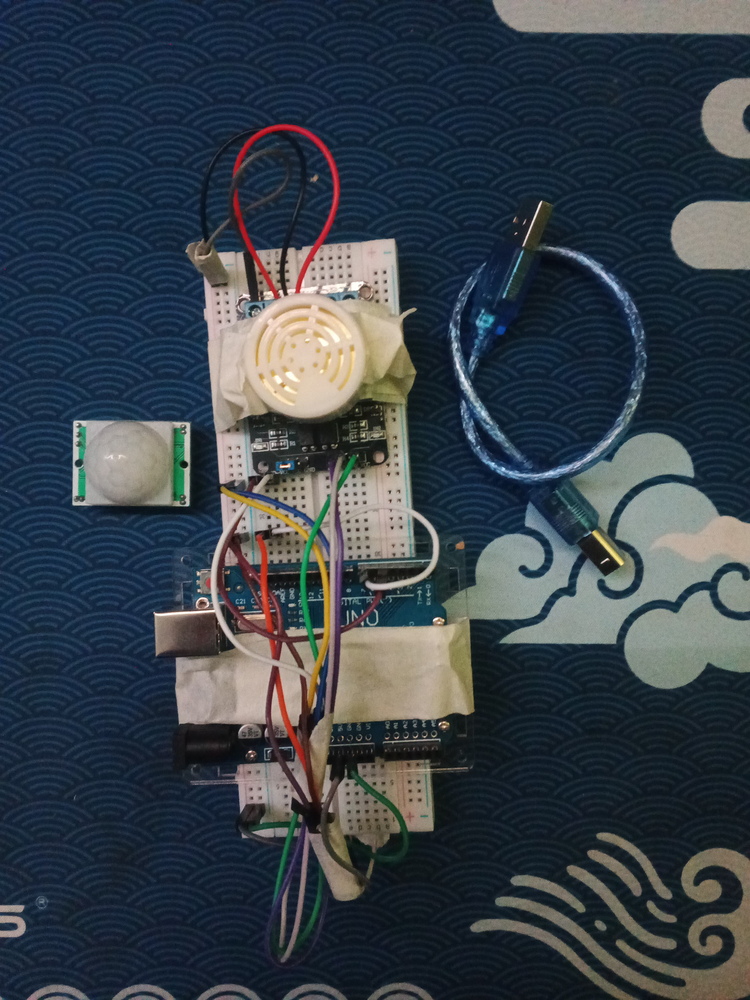

# Kelompok 2 IOT 
## Sistem Keamanan Berbasis Pendeteksi Gerakan dan Alarm

## Anggota Kelompok
- Zildjian Vito Sulaiman (09021382227140)
- CH Angga Marcelio (09021382227160)
- M. DZAWIL FADHOL ABIDULLAH (09021182227023)
- MUHAMMAD ADLAN AZZIKRA (09021282227068)

## Bahasa Pemrograman
- C++

## Deskripsi Project
Project ini membangun sistem keamanan rumah sederhana dengan Arduino Uno R3. Sistem ini menggunakan sensor PIR untuk mendeteksi gerakan dan memicu alarm buzzer. Project ini membantu meningkatkan rasa aman dan nyaman di rumah.

## Alat dan Bahan
- Arduino Uno R3
- Sensor PIR
- Buzzer
- Resistor
- Kapasitor
- Jumper wire
- Breadboard
- Adaptor AC-DC 9V

## Penyusunan Alat dan Bahan
1. Siapkan alat dan bahan: Arduino Uno R3, sensor PIR, buzzer, resistor, kapasitor, jumper wire, breadboard, adaptor AC-DC 9V.
2. Hubungkan Vcc sensor PIR ke pin 5V Arduino.
3. Hubungkan GND sensor PIR ke pin GND Arduino.
4. Hubungkan Output sensor PIR ke pin digital 2 Arduino.
5. Hubungkan kaki positif buzzer ke pin digital 3 Arduino.
6. Hubungkan kaki negatif buzzer ke pin GND Arduino.
7. Hubungkan resistor 100 ohm antara kaki positif buzzer dan pin digital 3 Arduino.
8. Buka Arduino IDE, buat sketch baru, salin dan tempel kode program.
9. Upload kode program ke Arduino Uno R3.
10. Hubungkan Arduino ke adaptor AC-DC 9V, uji sistem dengan simulasi gerakan di depan sensor PIR, buzzer akan berbunyi.

## Mekanisme Kerja 
Sistem keamanan rumah ini bekerja dengan cara mendeteksi gerakan dan memicu alarm. Berikut mekanismenya:

- Sensor PIR: Sensor PIR mendeteksi perubahan panas yang terjadi di area jangkauannya. Ketika ada orang atau benda yang bergerak di depan sensor, sensor akan mendeteksi perubahan panas dan menghasilkan sinyal output.
- Arduino Uno R3: Arduino Uno R3 menerima sinyal output dari sensor PIR. Arduino Uno R3 diprogram untuk memproses sinyal output dan menentukan apakah ada gerakan yang terdeteksi.
- Buzzer: Jika Arduino Uno R3 mendeteksi gerakan, maka Arduino akan mengirimkan sinyal ke buzzer. Buzzer akan berbunyi untuk memberikan alarm tanda bahaya.

## Finisihing Project

